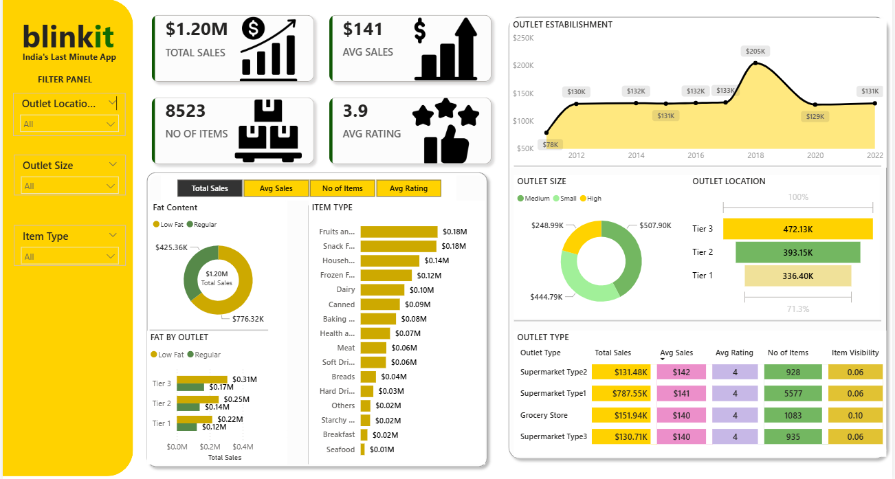

# 🛒 Blinkit Business Intelligence Analysis


> End-to-end business intelligence analysis of Blinkit's 
> e-commerce grocery operations — uncovering demand-supply gaps,
> revenue opportunities, and outlet performance insights through 
> an interactive Power BI dashboard.

---

## 🖥️ Dashboard Preview



---

## 📊 Key Metrics (From Dashboard)

<div align="center">

| 💰 KPI | 📈 Value |
|--------|---------|
| 🏆 Total Sales | **$1.20M** |
| 📦 Average Sales | **$141** |
| 🛒 Total Items | **8,523** |
| ⭐ Average Rating | **3.9 / 5** |

</div>

---

## 📌 Project Overview

Blinkit (formerly Grofers) is India's leading instant grocery 
delivery platform. This project analyzes **8,523 product records** 
across multiple outlet types, locations, and item categories to 
surface key performance drivers and business opportunities.

---

## 🎯 Business Questions Answered

- 📦 Which item types drive the most revenue?
- 🏪 Which outlet type and size performs best?
- 📍 How does Tier 1 vs Tier 2 vs Tier 3 location affect sales?
- 🥗 Does fat content (Low Fat vs Regular) influence purchasing?
- 📅 What is the sales trend by outlet establishment year?
- 👁️ How does item visibility impact sales performance?

---

## 🔍 Key Insights

### 🏆 Top Performing Categories
| Item Type | Total Sales |
|-----------|------------|
| 🍎 Fruits & Vegetables | **$0.18M** |
| 🍿 Snack Foods | **$0.18M** |
| 🏠 Household | **$0.14M** |
| 🧊 Frozen Foods | **$0.12M** |
| 🥛 Dairy | **$0.10M** |

### 🏪 Outlet Type Performance
| Outlet Type | Total Sales | Avg Sales | Avg Rating | Items |
|-------------|------------|-----------|------------|-------|
| Supermarket Type 1 | **$787.55K** | $141 | 4 | 5,577 |
| Grocery Store | $151.94K | $140 | 4 | 1,083 |
| Supermarket Type 2 | $131.48K | $142 | 4 | 928 |
| Supermarket Type 3 | $130.71K | $140 | 4 | 935 |

### 📍 Sales by Location (Tier)
| Location | Sales |
|----------|-------|
| 🥇 Tier 3 | **$472.13K** |
| 🥈 Tier 2 | $393.15K |
| 🥉 Tier 1 | $336.40K |

### 🥗 Fat Content Analysis
| Category | Sales |
|----------|-------|
| Low Fat | **$776.32K** |
| Regular | $425.36K |

### 📅 Outlet Establishment Trend
| Year | Sales |
|------|-------|
| 2012 | $78K |
| 2016 | $131K |
| **2018** | **$205K** ← Peak Year |
| 2022 | $131K |

### 🏗️ Outlet Size Breakdown
| Size | Sales |
|------|-------|
| Medium | $507.90K |
| Small | $444.79K |
| High | $248.99K |

---

## 🛠️ Tools Used

| Tool | Purpose |
|------|---------|
| 📊 **Power BI** | Interactive dashboard, DAX measures, KPI cards |
| 📁 **Excel** | Source data (BlinkIT Grocery Data.xlsx) |
| 🎨 **Custom Design** | Background KPI template, icon pack |

---

## ✅ Dashboard Features

- **Filter Panel** — Outlet Location, Outlet Size, Item Type
- **KPI Cards** — Total Sales, Avg Sales, No. of Items, Avg Rating
- **Fat Content Analysis** — Donut chart split by Low Fat / Regular
- **Fat by Outlet** — Stacked bar by Tier with fat content split
- **Item Type Breakdown** — Horizontal bar chart (16 categories)
- **Outlet Establishment Trend** — Line chart 2012–2022
- **Outlet Size** — Donut chart (Medium / Small / High)
- **Outlet Location** — Horizontal bar by Tier (1, 2, 3)
- **Outlet Type Table** — Full comparison matrix

---

## 📁 Repository Files

| File | Description |
|------|-------------|
| `blinkit.pbix` | Power BI dashboard (interactive) |
| `BlinkIT Grocery Data.xlsx` | Raw dataset — 8,523 records |
| `images/dashboard_screenshot.png` | Dashboard preview |
| `images/background kpi.png` | Custom KPI background design |

---

## 🚀 How to Use

### Open the Dashboard
```
1. Download blinkit.pbix
2. Open in Power BI Desktop (free from Microsoft)
3. All data is embedded — ready to explore!
4. Use Filter Panel to slice by outlet size, location & item type
```

### Explore the Raw Data
```
1. Download BlinkIT Grocery Data.xlsx
2. Open in Microsoft Excel
3. 8,523 rows × 12 columns ready for exploration
```

---

## 🔗 Connect With Me

[](https://linkedin.com/in/saksham-agarwal-1308)
[](mailto:saksham.agrwl@gmail.com)

---

<div align="center">

⭐ **Star this repo if you found it useful!**

*Part of my Data Analytics Portfolio — 
[View More Projects](https://github.com/saksham-agarwal)*

</div>
